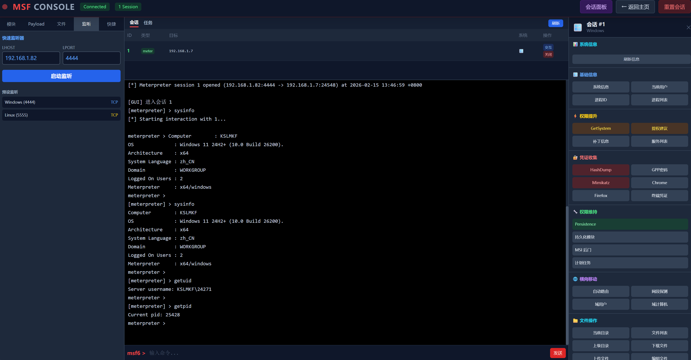

# TMbox (偷摸箱)

TMbox is a real-time web-based security operations dashboard for Raspberry Pi/Linux environments. It provides a unified interface for running vulnerability scanners, network tools, and the Metasploit Framework with live output streaming via WebSockets.



## Features

- **System Monitoring**: Real-time CPU load and memory usage display
- **Network Scanning**: Integrated Nmap, Fscan, Nuclei, Feroxbuster, Sqlmap
- **MSF Console**: Web-based Metasploit Framework interface with:
  - Session management sidebar
  - OS-aware operations (Windows/Linux)
  - Quick command buttons
  - Payload generator with download
- **Network Topology**: Visual network mapping with D3.js
- **Multi-tool Support**: Run multiple scans concurrently

## Requirements

- Node.js 16+
- System tools (installed and in `$PATH`):
  - `nuclei` - Vulnerability scanner
  - `nmap` - Network scanner
  - `fscan` - Port scanner
  - `sqlmap` - SQL injection tool
  - `feroxbuster` - Directory brute force
  - `msfconsole` - Metasploit Framework
  - `unbuffer` (from `expect` package)

## Installation

```bash
# Clone the repository
git clone https://github.com/YOUR_USERNAME/TMbox.git
cd TMbox

# Install dependencies
npm install

# Start the server
npm start
```

Access the dashboard at `http://localhost:3000` or `http://<device-ip>:3000`

## System Dependencies

```bash
# Debian/Ubuntu
sudo apt install expect nmap sqlmap

# Install security tools
# nuclei, fscan, feroxbuster, msfconsole need to be installed separately
```

## Project Structure

```
TMbox/
├── server.js          # Main server with Socket.IO
├── package.json       # Dependencies
├── public/
│   ├── index.html     # Main dashboard
│   ├── msf.html       # MSF console interface
│   └── topology.html  # Network topology visualization
└── README.md
```

## Usage

1. **Main Dashboard** (`/`): System monitoring and scan tools
2. **MSF Console** (`/msf`): Metasploit Framework interface
3. **Network Topology** (`/topology`): Visual network mapping

## License

MIT License
