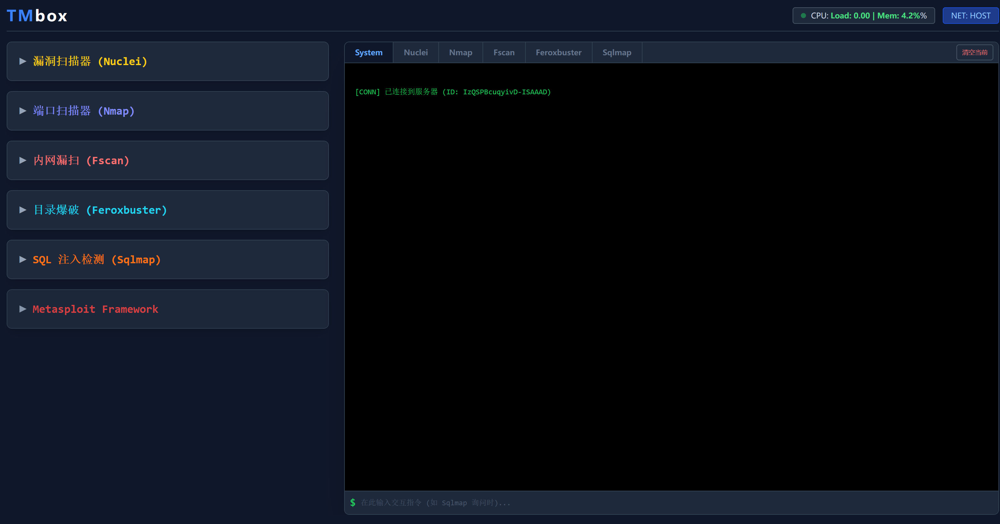

TMbox - 树莓派攻防控制台
========================

> ⚠️ **警告 / WARNING**
>
> **使用本工具务必遵守当地法律法规！**
>
> 本工具仅供**学习研究、安全测试和授权渗透测试**使用。
>
> **任何使用本工具的人无论做了什么事情，均与原作者无关。**
>
> 未经授权使用本工具进行攻击所产生的一切法律后果由使用者自行承担。
>
> This tool is for **educational and authorized security testing purposes only**.
>
> The author is **NOT responsible** for any misuse or illegal activities.

> 🐛 **Bug 反馈**
>
> 本项目有很多 Bug 正待发现，如果你发现了，欢迎提交 Issue。
>
> **请勿攻击任何与项目有关的人或使用本项目的人。**

---

更新日志
--------
- 新增 Webshell 管理模块（支持 PHP 8.x / 7.x / 通用、ASP、ASPX、JSP）
- 新增 60+ 种 Webshell 生成器（含免杀混淆）
- 新增后端代理解决 CORS 跨域问题
- 新增 TCP 代理（端口转发、SOCKS5、HTTP 代理）
- 新增 Webshell 自动扫描功能
- 新增反弹 Shell 生成
- 修复系统信息显示
- 修复文件管理器

功能特性
--------
- 实时系统监控（CPU/内存）
- Nuclei / Nmap / Fscan / Sqlmap 集成
- Metasploit Framework 控制台
- 网络拓扑可视化
- Webshell 管理（生成/连接/文件管理）
- TCP 代理

运行方法
--------
```bash
# 安装依赖
npm install

# 启动服务器
node server.js

# 访问地址
http://localhost:3000
https://localhost:3443  # TLS 加密
```

页面路由
--------
| 路由 | 功能 |
|------|------|
| `/` | 主仪表板 |
| `/msf` | Metasploit 控制台 |
| `/topology` | 网络拓扑 |
| `/webshell` | Webshell 管理 |

系统依赖
--------
需要安装以下工具并确保在 $PATH 中：
- `nuclei` - 漏洞扫描器
- `nmap` - 网络扫描器
- `fscan` - 内网综合扫描
- `sqlmap` - SQL 注入工具
- `msfconsole` - Metasploit Framework
- `unbuffer` - 来自 expect 包，用于实时输出

安装依赖（Debian/Ubuntu）：
```bash
# Node.js 依赖
npm install

# expect (提供 unbuffer)
sudo apt install expect

# 安全工具 (根据需要安装)
sudo apt install nmap sqlmap
# nuclei, fscan, msfconsole 需要单独安装
```

项目截图
--------



许可证
--------
GNU General Public License v3.0 (GPL v3)
